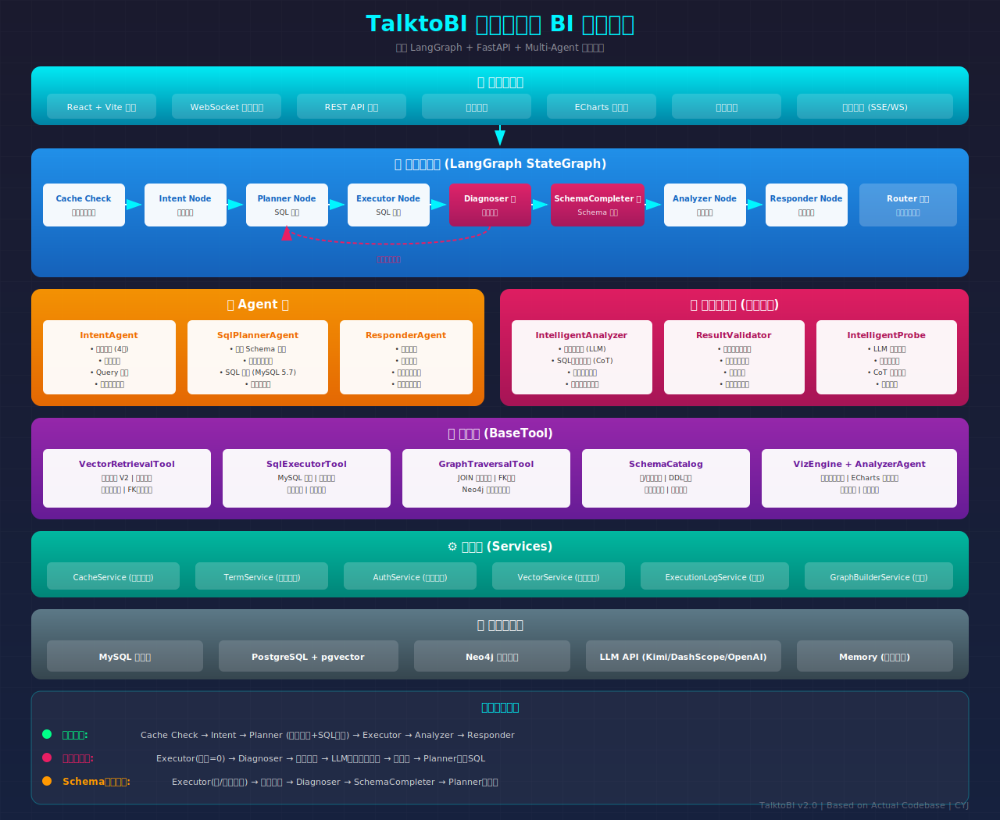

# TalktoBI 

> 🤖 基于 LangChain + FastAPI 的智能分析对话系统

TalktoBI 是一个智能 BI 对话系统，支持用户通过自然语言查询业务数据。系统采用多 Agent 协同架构，包含意图识别、SQL 规划、智能诊断、响应生成等核心模块。

## 系统架构



## 核心特性

- 🤖 **多 Agent 协同**：IntentAgent、SqlPlannerAgent、ResponderAgent 协同工作
- 🔍 **智能诊断**：零结果诊断、Schema 错误自动修复
- 📊 **可视化支持**：自动生成 ECharts 图表配置
- 💬 **多轮对话**：支持上下文记忆和会话管理
- ⚡ **流式响应**：WebSocket 实时推送处理状态
- 🛡️ **智能缓存**：基于语义相似度的查询缓存

## 环境要求

- Python 3.10+
- MySQL 8.0+
- PostgreSQL 14+ (with pgvector)
- Neo4j 5.x
- Conda (推荐)

## 快速开始

### 0. 安装依赖

```bash
# 进入项目目录
cd chatbi-backend

# 创建并激活虚拟环境（推荐）
conda create -n talktobi python=3.10
conda activate talktobi

# 安装依赖
pip install -r requirements.txt
```

### 1. 数据库初始化

#### 1.1 MySQL 数据库

```bash
# 创建业务数据库并执行建表
mysql -u root -p < scripts/init/ecommerce_schema.sql

# 创建系统数据库（用户认证）
mysql -u root -p < scripts/init/init_auth_tables.sql

# 创建缓存和日志表
mysql -u root -p chatbi_sys < scripts/init/create_query_cache.sql
mysql -u root -p chatbi_sys < scripts/init/create_execution_log.sql
```

#### 1.2 PostgreSQL 向量数据库

```bash
# 先创建数据库
psql -U postgres -c "CREATE DATABASE chatbi_pg;"

# 初始化向量表（schema_embeddings + term_embeddings）
psql -U postgres -d chatbi_pg -f scripts/init/init_vector_db.sql
```

向量数据库包含两张表：

| 表名 | 用途 |
|------|------|
| `schema_embeddings` | 存储表/列的语义向量，支持 Schema 召回 |
| `term_embeddings` | 存储业务术语向量（可选） |

### 2. 生成模拟数据

```bash
# 生成电商示例数据
python scripts/data_gen/gen_mock_data_v2.py
```

### 3. 配置环境变量

```bash
# 复制示例配置
cp .env.example .env

# 编辑 .env 文件，填入实际的数据库连接信息和 API Key
```

主要配置项：

| 配置项 | 说明 | 示例 |
|-------|------|------|
| `MYSQL_HOST` | 业务数据库地址 | localhost |
| `MYSQL_PASSWORD` | 业务数据库密码 | your_password |
| `SYS_DB_HOST` | 系统数据库地址 | localhost |
| `VECTOR_DB_HOST` | 向量数据库地址 | localhost |
| `NEO4J_URI` | Neo4j 连接地址 | bolt://localhost:7687 |
| `LLM_KEY` | LLM API Key | sk-xxx |
| `LLM_PROVIDER` | LLM 提供商 | kimi / dashscope / openai |

### 4. 构建知识库（可选）

```bash
# 提取 Schema 元数据
python scripts/knowledge/extract_schema.py

# 构建向量索引
python scripts/knowledge/build_vector_db.py

# 构建知识图谱
python scripts/knowledge/build_graph.py
```

### 5. 启动服务

```bash
# 开发模式启动
python run.py

# 生产模式启动
python run.py --prod

# 指定端口
python run.py --port 8000

# 调试模式
python run.py --debug
```

## 服务地址

启动后可访问以下地址：

| 服务 | 地址 |
|------|------|
| HTTP API | http://localhost:7000/api/v1/ |
| WebSocket | ws://localhost:7000/api/v1/ws/chat/{session_id} |
| API 文档 | http://localhost:7000/docs |
| 健康检查 | http://localhost:7000/health |

## 前后端联调

- **后端地址**：http://localhost:7000
- **前端地址**：http://localhost:5173 (默认 Vite 端口)

前端项目位于 `talktobi-frontend/` 目录。

## 核心处理流程

### 正常查询流程
```
用户提问 → Intent(意图识别) → Planner(SQL规划) → Executor(执行) → Analyzer(分析) → Responder(响应)
```

### 零结果诊断流程
```
Executor(数据=0) → 实体提取 → LLM语义扩展探针 → 值映射 → Planner重写SQL
```

### Schema 错误诊断流程
```
Executor(表/列不存在) → 解析错误 → 检查Schema存在性 → Diagnoser → SchemaCompleter
```

## 目录结构

```
talktobi-backend/
├── app/
│   ├── api/v1/           # API 端点
│   │   ├── endpoints/    # 核心端点 (chat, ws_chat, graph_builder)
│   │   ├── auth.py       # 认证接口
│   │   ├── cache.py      # 缓存管理
│   │   ├── logs.py       # 日志查询
│   │   ├── terms.py      # 专业名词
│   │   └── vectors.py    # 向量管理
│   ├── core/             # 核心配置
│   │   ├── config.py     # 全局配置
│   │   ├── database.py   # 数据库连接
│   │   ├── llm.py        # LLM 客户端
│   │   └── state.py      # 状态定义
│   ├── modules/          # 业务模块
│   │   ├── agents/       # Agent 实现
│   │   ├── diagnosis/    # 智能诊断
│   │   ├── dialog/       # 对话编排
│   │   ├── graph/        # 图谱操作
│   │   ├── schema/       # Schema 管理
│   │   ├── tools/        # 工具层
│   │   ├── validators/   # 验证器
│   │   ├── vector/       # 向量存储
│   │   └── viz/          # 可视化
│   ├── schemas/          # Pydantic 模型
│   ├── services/         # 业务服务
│   └── utils/            # 工具函数
├── scripts/              # 脚本
│   ├── init/             # 数据库初始化
│   ├── data_gen/         # 数据生成
│   └── knowledge/        # 知识库构建
├── tests/                # 测试用例
├── .env.example          # 环境变量示例
├── run.py                # 启动入口
└── requirements.txt      # 依赖列表
```


## 默认账户

系统初始化后会创建一个 root 账户：

- **用户名**: root
- **密码**: 123456

⚠️ 请在生产环境中及时修改默认密码！


## License

MIT License

## Author

CYJ
